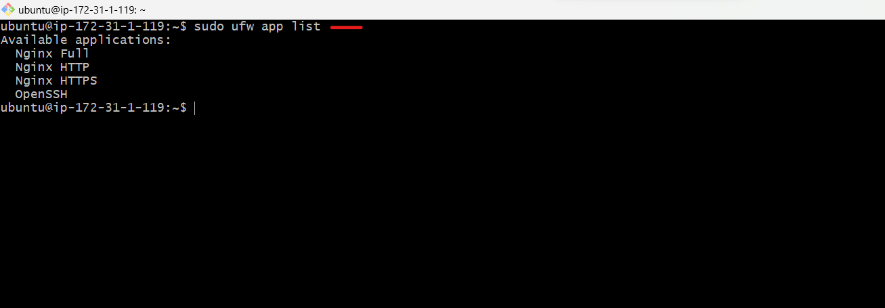
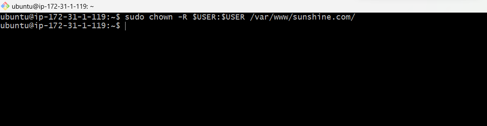

# Lemp-stack-project

## LEMP STACK

__LEMP__ is a combination of four open-source technologies that are used in web development. 

__LEMP__ Stands For:

__L__- Linux Operating System that runs the web server.

__E__- Nginx Server the web server software that handles HTTP requests.

__M__- MySQL Database management system that stores the website’s data.

__P__- PHP,the programming language used to build dynamic web applications.

__How does the LEMP Stack work?__

_The LEMP stack works by using Nginx as the web server, which listens for HTTP requests and forwards them to the appropriate PHP script. The PHP script generates a response, which is then sent back to the user via Nginx._

_MySQL is used to store and manage the website’s data. PHP communicates with MySQL to retrieve and store data as needed._

__INSTALLING THE NGINX WEB SERVER__

_let's launch an instance on our AWS account, give it any name of your choice_

_choose ubuntu OS_

_Choose t2.micro and create a keypair_

_create a security group, to allow HTTPS traffic and launch instance_

_let's ssh into our ubuntu terminal_

ssh -i Downloads/jenkinskey.pem ubuntu@13.57.214.123

downloads: is where your keypair is kept

jenkinskey.pem: is the name of your keypair

ubuntu: is the name of your server

13.57.214.123: is the ip address

__let's install nginx__

_first we update ,so that all the latest applications can be installed smoothly._

`sudo apt update`

`sudo apt install nginx`

_If you have the uncomplicated firewall (__ufw__) firewall enabled, as recommended in our initial server setup guide, you will need to allow connections to Nginx._

_to list and open all available firewall_

`sudo ufw app list`

_to allow traffic on port 80_

`sudo ufw allow in "nginx full"`

_to check if the service is running_

`sudo systemctl status nginx`

_you can test if the server is up and running by accessing your public IP address in your web browser._

_If you receive this page, it means you have successfully installed Nginx and enabled HTTP traffic for your web server._

 

 __INSTALLING MYSQL-SERVER__

 Now that you have a web server up and running, you need to install the database system to store and manage data for your site.

 `sudo apt install mysql-server`

 

 _check the version_

 `mysql --version`

 

 _Start the interactive script that will remove some insecure default settings and lock down access to your database system._

 `sudo mysql_secure_installation`

 

 There are three levels of password validation policy:

LOW    Length >= 8

MEDIUM Length >= 8, numeric, mixed case, and special characters

STRONG Length >= 8, numeric, mixed case, special characters and dictionary file

Please enter 0 = LOW, 1 = MEDIUM and 2 = STRONG:

 _log into mysql_

`sudo mysql`

_to set password as "Password123@" for root user_

`ALTER USER 'root'@'localhost' IDENTIFIED WITH mysql_native_password BY 'Password123@'`

then _"exit"_ mysql console

`mysql> exit`

_log into mysql using my new password_

`sudo mysql -p`

then "exit"

`mysql> exit`

__INSTALLING PHP__

You have __Nginx__ installed to serve your content and __MySQL__ installed to store and manage your data. Now you can install PHP to process code and generate dynamic content for the web server.

 `sudo apt install php-fpm php-mysql`

_you now have the PHP component installed._

_create the root web directory for your domain name_

`sudo mkdir /var/www/sunshine.com/html`

_then assign ownership of the directory with the $USER environment variable_

`sudo chown -R $USER:$USER /var/www/sunshine.com/`

_then open a new configuration file in nginx sites-available directory_

`sudo nano /etc/nginx/sites-available/sunshine.com/`

_enabling your configuration file_

`sudo ln -s /etc/nginx/sites-available/sunshine.com /etc/nginx/sites-enabled/`

_reload Nginx to reflect the change and enable the server block’s configuration file_

`sudo systemctl reload nginx`

_to open the configuration file_

`sudo nano /etc/nginx/nginx.conf`

_checking your configuration file_

`sudo nginx -t`

_To access the Nginx process’s systemd logs_

`sudo journalctl -u nginx`

__TESTING PHP WITH NGINX__

`sudo nano /var/www/sunshine.com/info.php`

_inside the file, type the PHP code:_

<?php

phpinfo ();

?>

